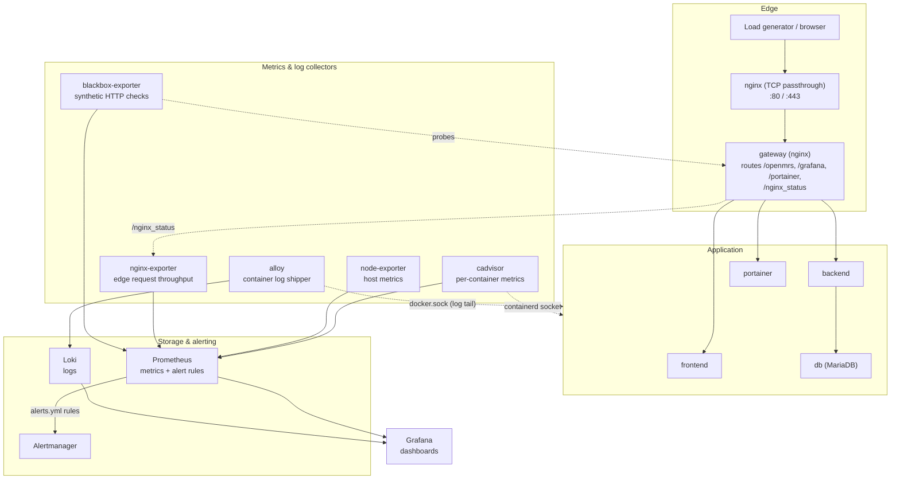

# Load-test monitoring stack

This extends the monitoring stack already in this repo (`docker-compose.grafana.yml` +
`monitoring/`) with host and per-container resource metrics, alerting, and a dashboard
purpose-built for sizing infrastructure from a load test. It's built entirely from
open-source tools and runs as regular Docker Compose services, so it maps directly onto
Kubernetes later (see [Migrating to Kubernetes](#migrating-to-kubernetes)).

Bring it up alongside the app:

```bash
docker compose -f docker-compose.yml -f docker-compose.grafana.yml up -d
```

Grafana: `http://<host>/grafana/` (admin / `${GRAFANA_ADMIN_PASSWORD:-Admin123}`).
Prometheus and Alertmanager aren't routed through the gateway by default (see
[Best practices](#best-practices-for-monitoring-during-a-load-test)); reach them with
`docker exec prometheus wget -qO- http://localhost:9090/...` or temporarily publish a port.

## 1. Architecture



Everything downstream of the collectors (Prometheus, Loki, Alertmanager, Grafana) reads
from Docker's network only - nothing here needs a host port published except Grafana
(proxied through the gateway at `/grafana`) and Portainer (`/portainer`).

## 2. Docker Compose services

All added in `docker-compose.grafana.yml`, alongside the pre-existing `loki`, `alloy`,
`blackbox`, and `grafana`:

| Service | Image | Purpose |
|---|---|---|
| `node-exporter` | `prom/node-exporter:v1.9.0` | Host CPU/memory/disk/load/network |
| `cadvisor` | `gcr.io/cadvisor/cadvisor:v0.49.1` | Per-container CPU/memory/network/disk/restarts/uptime |
| `nginx-exporter` | `nginx/nginx-prometheus-exporter:1.4.2` | Turns the gateway's `stub_status` into Prometheus metrics (edge request rate) |
| `alertmanager` | `prom/alertmanager:v0.28.1` | Routes firing alerts to a receiver (Slack/email/etc.) |
| `prometheus` | `prom/prometheus:v3.9.0` (pre-existing) | Now also loads `alerts.yml` and talks to Alertmanager |

**A host-specific gotcha worth knowing about:** this host's Docker runs the newer
**containerd-snapshotter** storage backend (`docker info` → `driver-type:
io.containerd.snapshotter.v1`) rather than the classic `overlay2` graphdriver. cAdvisor's
normal Docker integration reads `/var/lib/docker/image/overlayfs/layerdb/mounts/<id>/mount-id`
to identify containers, which doesn't exist under this backend - with only the usual
`/rootfs`, `/var/run`, `/sys`, `/var/lib/docker` mounts, cAdvisor only sees raw
host/systemd cgroups and **zero actual containers**. The fix (already applied in
`docker-compose.grafana.yml`) is to point cAdvisor at containerd directly, which Docker
itself runs on top of even in this mode:

```yaml
volumes:
  - /run/containerd/containerd.sock:/run/containerd/containerd.sock:ro
command:
  - --docker=                        # disable the broken Docker/graphdriver path
  - --containerd=/run/containerd/containerd.sock
  - --containerd-namespace=moby      # Docker's containers live in containerd's "moby" namespace, not cAdvisor's k8s-oriented default
```

One side effect: via containerd, cAdvisor only gets a raw container ID as the `name`
label (Docker's own container-name metadata isn't visible from there), so
`prometheus.yml`'s `cadvisor` job adds a `metric_relabel_configs` that derives a readable
`container_image` label from the image field instead (e.g. `gateway` from
`.../openmrs-reference-application-3-gateway:qa`). All queries/dashboards/alerts in this
stack group by `container_image`, not `name`. If you run this stack on a host using the
classic `overlay2` driver, the plain Docker-based cAdvisor config works fine too, and
you'd get real container names for free - but the containerd approach still works there
too, so there's no need to special-case it.

A second, more significant side effect: `container_network_*` metrics (receive/transmit
bytes) only populate for the **root cgroup** (`id="/"`, i.e. host-wide totals) under this
containerd-only path, not per individual container - verified live on this host. cAdvisor
normally gets the interface-to-container mapping either from Docker's own inspect API
(disabled here) or from Kubernetes CRI PodSandbox metadata (not applicable outside k8s);
plain containerd alone doesn't supply it. CPU, memory, filesystem, and restart/uptime
metrics are all unaffected and work correctly per-container. The "Network I/O by
container" dashboard panel and any `container_network_*{name!=...}` query will return no
data on a host in this configuration - use the host-aggregate `node_network_*` metrics
instead (see the dashboard's "Host network I/O" panel and the PromQL cheat sheet below),
or, if per-service breakdown matters for your capacity plan, run this stack on a host
using the classic `overlay2` storage driver instead, where the plain Docker-based
cAdvisor path (not containerd) handles this correctly.

If you add more services to this project, nothing else needs to change - cAdvisor and
node-exporter auto-discover everything on the host.

## 3. Prometheus configuration

`monitoring/prometheus/prometheus.yml` scrapes:

- `prometheus` - itself
- `node-exporter:9100` - host metrics
- `cadvisor:8080` - per-container metrics
- `nginx-exporter:9113` - edge request throughput
- `blackbox-http-prod` (pre-existing) - synthetic HTTP checks against the gateway

It also loads `monitoring/prometheus/alerts.yml` via `rule_files` and points `alerting.alertmanagers`
at `alertmanager:9093`. All of this is copied into the shared `prometheus-config` volume
by the `monitoring-init` container on startup (see `monitoring/entrypoint.sh`) - edit the
files in `monitoring/prometheus/`, rebuild `monitoring-init`, and restart Prometheus to
pick up changes:

```bash
docker compose -f docker-compose.yml -f docker-compose.grafana.yml build monitoring-init
docker compose -f docker-compose.yml -f docker-compose.grafana.yml up -d monitoring-init
docker exec prometheus wget -qO- --post-data='' http://localhost:9090/-/reload   # hot reload, no restart needed (--web.enable-lifecycle is set)
```

If you'd rather not add a new microservice's target manually, the commented-out example
at the bottom of `prometheus.yml` shows the pattern for a `/metrics` endpoint. This repo
intentionally uses `static_configs` rather than `docker_sd_configs` (which would need the
Docker socket mounted into Prometheus, widening its blast radius) - for a fixed
docker-compose stack, a short explicit target list is easier to audit than dynamic
discovery. On Kubernetes you'd replace this whole file with a Prometheus Operator
`ServiceMonitor`/`PodMonitor` per service anyway.

## 4/9. Grafana dashboards

Provisioned automatically (file-based provisioning, no manual import needed):

- **Load Test Infrastructure Overview** (`monitoring/dashboards/load-test-overview-dashboard.json`,
  new) - the main dashboard for this exercise. Host CPU/memory/load/disk stats and
  trends, per-container CPU/memory/memory-%-of-limit/network/disk-I/O, a restarts table,
  an uptime table, and edge request rate + synthetic probe latency.
- **Endpoint health check** (pre-existing) - blackbox probe uptime/latency/SSL detail per
  monitored URL.
- **Logs dashboard** (pre-existing) - Loki-backed log browser.

Recommended community dashboards to additionally import (Dashboards → New → Import, by
ID, using the pre-provisioned `Prometheus` datasource) if you want more depth than the
custom dashboard above:

| ID | Name | Covers |
|---|---|---|
| 1860 | Node Exporter Full | Deep host metrics (per-core, per-mount, per-NIC) |
| 193 | Docker cAdvisor Dashboard | Alternative per-container view |
| 3662 | Prometheus 2.0 Overview | Prometheus's own health/ingestion rate |

## 5/6. Container & host metrics reference

Per container (cAdvisor), all label-able by `container_image`:

| Metric | What it is |
|---|---|
| `container_cpu_usage_seconds_total` | Cumulative CPU seconds; `rate()` it for usage |
| `container_memory_working_set_bytes` | Memory actually in use (what OOM-killer watches) |
| `container_spec_memory_limit_bytes` | Configured memory limit (`0` = unlimited on this host, see the guard in `alerts.yml`) |
| `container_network_{receive,transmit}_bytes_total` | Network I/O |
| `container_fs_{reads,writes}_bytes_total` | Disk I/O |
| `container_start_time_seconds` | Used for uptime (`time() - ...`) and restart detection (`changes(...)`) |

Host-level (node-exporter):

| Metric | What it is |
|---|---|
| `node_cpu_seconds_total{mode="idle"}` | Invert for CPU usage % |
| `node_memory_MemAvailable_bytes` / `node_memory_MemTotal_bytes` | Memory usage % |
| `node_filesystem_avail_bytes` / `node_filesystem_size_bytes` | Disk usage % |
| `node_load1` / `node_load5` / `node_load15` | Load average |
| `node_network_{receive,transmit}_bytes_total` | Network I/O |

## 7. Application-level metrics

None of the current backend/frontend images expose a Prometheus `/metrics` endpoint (no
Micrometer/Actuator or equivalent is wired into this distro), so request
count/latency/error-rate/throughput/active-requests in the strict "app instrumented
itself" sense aren't available out of the box. Two things are available today instead,
and a third is the real fix if you need proper histograms:

1. **Edge request throughput** - real Prometheus metrics, via `nginx-exporter` scraping the
   gateway's `stub_status` (enabled at `location = /nginx_status` in
   `gateway/default.conf.template` / `default-ssl.conf.template`, restricted to private IP
   ranges). Gives `nginx_http_requests_total` (→ requests/sec) and
   `nginx_connections_active`. No per-route or per-status breakdown - stub_status doesn't
   have that granularity.
2. **Latency and error rate** - via Loki. `gateway/nginx.conf`'s access log format now
   includes `rt=$request_time uct=$upstream_connect_time uht=$upstream_header_time
   urt=$upstream_response_time` and the existing status code, and Alloy already ships
   every container's logs to Loki. See the LogQL queries below.
3. **Real per-request metrics** - if you add a service that exposes Prometheus metrics
   (Spring Boot Actuator, `express-prom-bundle`, etc.), add it to `prometheus.yml` per the
   commented example - you'd get proper `http_requests_total`/histogram-based latency for
   free.

LogQL for the gateway's access log (Loki datasource, already provisioned):

```logql
# requests/sec by status class, from the gateway container's access log
sum by (status_class) (
  rate(
    {service_name="gateway"}
    | pattern `<ip> - <user> [<ts>] "<method> <path> <proto>" <status> <bytes> "<ref>" "<ua>" "<xff>" rt=<rt> uct=<uct> uht=<uht> urt=<urt>`
    | label_format status_class="{{ if ge (int .status) 500 }}5xx{{ else if ge (int .status) 400 }}4xx{{ else }}2xx/3xx{{ end }}"
    [$__interval]
  )
)

# 95th percentile request time from the same parsed field (rt, in seconds)
quantile_over_time(0.95,
  {service_name="gateway"}
  | pattern `<ip> - <user> [<ts>] "<method> <path> <proto>" <status> <bytes> "<ref>" "<ua>" "<xff>" rt=<rt> uct=<uct> uht=<uht> urt=<urt>`
  | unwrap rt [$__interval]
)

# error rate (5xx / total)
sum(rate({service_name="gateway"} |= "\" 5" [$__interval]))
/
sum(rate({service_name="gateway"}[$__interval]))
```

All three verified directly against this stack's live Loki. One gotcha on the error-rate
query: unlike PromQL, if zero lines match `|= "\" 5"` in a given time bucket, Loki returns
no series at all rather than a literal `0` - a Grafana panel on this query will show gaps
during error-free periods instead of a flat line at zero. That's expected, not a broken
query.

A Loki **ruler** can alert on the same queries if you want error-rate/latency alerting
without adding app instrumentation - not enabled here to keep the stack's own footprint
small (see [Best practices](#best-practices-for-monitoring-during-a-load-test)); if you
add it, mirror the pattern in `monitoring/prometheus/alerts.yml`.

## 8. PromQL cheat sheet

```promql
# Highest CPU-consuming service right now (% of one core)
topk(1, sum by (container_image) (rate(container_cpu_usage_seconds_total{name!=""}[5m])) * 100)

# Highest memory-consuming service right now
topk(1, container_memory_working_set_bytes{name!=""})

# Peak network usage (receive), host-wide, over the whole load-test window.
# Per-container network breakdown (container_network_receive_bytes_total{name!=""})
# is a cAdvisor metric in principle, but on this host it only ever populates
# for the root cgroup (id="/"), not individual containers - verified live:
# cAdvisor's containerd integration has no CRI PodSandbox network-namespace
# metadata to correlate interfaces to containers outside Kubernetes, and we
# disabled its (broken, see section 2) Docker integration that would
# otherwise supply that mapping. If you're on a host using the classic
# overlay2 storage driver, `container_network_receive_bytes_total{name!=""}`
# works normally and gives you the true per-service breakdown - swap it in.
max_over_time(
  (sum(rate(node_network_receive_bytes_total{device!~"lo|veth.*|docker.*|br-.*"}[1m])))[$__range:1m]
)

# Average CPU per service during the load test (set the time picker to the test window)
avg_over_time(
  (sum by (container_image) (rate(container_cpu_usage_seconds_total{name!=""}[1m])))[$__range:1m]
)

# 95th percentile CPU per service during the load test
quantile_over_time(0.95,
  (sum by (container_image) (rate(container_cpu_usage_seconds_total{name!=""}[1m])))[$__range:1m]
)

# Memory growth over time (bytes gained since the start of the range - a positive,
# growing number across a soak test suggests a leak rather than steady-state usage)
deriv(container_memory_working_set_bytes{name!=""}[$__range])
# or, for a simple before/after delta:
container_memory_working_set_bytes{name!=""} - container_memory_working_set_bytes{name!=""} offset $__range
```

`$__range`/`$__interval` are Grafana template variables that resolve to the dashboard's
current time range/step - paste these into a Grafana panel, or substitute a literal
duration (e.g. `[30m]`) to run them in the Prometheus UI directly.

## 10. Alerting

`monitoring/prometheus/alerts.yml`, three groups:

- **container-resource-alerts**: `ContainerHighCpuUsage` (>80% of one core, 3m),
  `ContainerHighMemoryUsage` (>80% of a *configured* limit, 3m - guarded against the `0`
  "no limit" sentinel described above, so it stays silent until you actually set
  `deploy.resources.limits.memory` on a service), `ContainerRestarted` (cAdvisor has no
  native restart counter under any backend, so this fires on any change to
  `container_start_time_seconds`).
- **host-resource-alerts**: `HostHighCpuUsage`, `HostHighMemoryUsage` (>80%, 5m),
  `HostHighLoadAverage` (5m load per core >1.5).
- **latency-and-availability-alerts**: `HighResponseTime` (blackbox probe >1s, 2m),
  `HighErrorRate` (blackbox probe failing, 2m - a coarse proxy; see the LogQL queries
  above for real 5xx-ratio alerting once you're willing to add a Loki ruler).

Alertmanager (`monitoring/alertmanager.yml`) ships with a **no-op receiver** - alerts show
up in Prometheus's Alerts page and Alertmanager's UI, but nothing gets paged anywhere
until you fill in a real receiver:

```yaml
receivers:
  - name: default
    slack_configs:
      - api_url: https://hooks.slack.com/services/XXX/YYY/ZZZ
        channel: '#load-test-alerts'
```

Edit `monitoring/alertmanager.yml`, then rebuild+restart `monitoring-init` and
`alertmanager` (same steps as reloading Prometheus config, above).

## 11. Best practices for monitoring during a load test

- **Don't route synthetic/monitoring traffic through the same path you're measuring.**
  Blackbox's probes and cAdvisor/node-exporter's scrapes are cheap (sub-1% CPU each in
  practice here), but if you're measuring gateway throughput under 50 concurrent users,
  keep Prometheus's `scrape_interval` reasonable (15s, as configured) rather than dropping
  it to 1s "for more resolution" - each container's `/metrics` scrape is itself a request
  the container has to serve, and shrinking the interval multiplies that load for
  marginal benefit at aggregate-usage scale.
  - Note this stack's gateway/nginx-proxy chain routes *all* internet traffic through
    `gateway:80` regardless of port (see the earlier TCP-passthrough note in this repo's
    history) - the `/nginx_status`, `/grafana`, `/portainer` paths on that same gateway
    are therefore reachable by anyone who can reach your load-test domain, not just
    internal callers, because the raw TCP proxy in front of it doesn't preserve or filter
    on source IP. The `allow`/`deny` IP restriction on `/nginx_status` is defense in depth
    for a more conventional deployment, not a real boundary here - don't treat it as one.
  - Don't put Prometheus/Alertmanager behind the public gateway at all (they aren't,
    today) - reach them via `docker exec` or a temporary `docker compose port-forward`-style
    published port scoped to your own IP, for the duration of the test only.
- **Isolate monitoring resource usage from app resource usage in your sizing math.**
  cAdvisor itself typically costs ~1-2% of a core and tens of MB of memory in this stack
  (visible on its own row in the dashboard) - when you read off "peak CPU" for capacity
  planning, exclude the monitoring containers (`cadvisor`, `node-exporter`,
  `nginx-exporter`, `prometheus`, `loki`, `alloy`, `grafana`, `alertmanager`,
  `blackbox`) from the total, since production won't run them at the same density (or
  will run them once per cluster, not once per app instance).
- **Give Prometheus's own storage headroom.** `--storage.tsdb.retention.time=15d` is set;
  for a multi-day load-testing campaign, watch `prometheus_tsdb_storage_blocks_bytes` and
  either shorten retention or extend the `prometheus_data` volume rather than let disk
  fill silently.
- **Run a baseline (idle) capture before the load test starts**, and a cool-down capture
  after it ends. "Minimum usage" in your sizing exercise should come from the idle
  baseline, not from gaps between requests during the test itself - concurrent load rarely
  drives every service to zero simultaneously, so an in-test minimum understates how low
  usage really goes at rest.
- **Watch `up{job=~".+"} == 0`** during the test. If a scrape target goes down under load
  (e.g. cAdvisor briefly starved of CPU by the containers it's watching), you get gaps in
  the data right when you need it most - a quick Grafana stat panel on `up` catches that
  early rather than discovering it in post-test analysis.

## 12. Correlating load-test metrics with Prometheus/Grafana

The general pattern for k6, JMeter, or Locust, in order of effort:

1. **Cheapest - align by time.** Note the load test's start/end wall-clock time and set
   that as the Grafana dashboard's time range (or add [Grafana annotations](https://grafana.com/docs/grafana/latest/dashboards/build-dashboards/annotate-visualizations/)
   marking test phases - ramp-up, steady-state, ramp-down - via the Grafana HTTP API from
   your test script's setup/teardown hooks). Good enough for "did resource usage spike
   when load started."
2. **Better - have the load-test tool push its own metrics into Prometheus**, so both
   series live in the same datasource and can share a dashboard/time axis exactly:
   - **k6**: run with `k6 run --out experimental-prometheus-rw script.js` (built-in remote-write
     output) or `k6 run --out statsd` into a `statsd_exporter` sidecar. Gives you
     `k6_http_reqs_total`, `k6_http_req_duration`, `k6_vus` alongside
     `container_cpu_usage_seconds_total` in the same Prometheus.
   - **JMeter**: use the [PrometheusListener plugin](https://github.com/johrstrom/jmeter-prometheus-plugin)
     (exposes a `/metrics` endpoint JMeter itself serves) and add it as a
     `static_configs` target in `prometheus.yml`, same pattern as the commented example.
   - **Locust**: use [`locust-exporter`](https://github.com/ContainerSolutions/locust_exporter)
     pointed at Locust's own stats API, and scrape that.
   Once any of these lands in Prometheus, build one dashboard with the load-test panel
   (VUs, req/s, error rate) stacked above the infrastructure panels (CPU/memory per
   service) on a shared time axis - that's the direct visual answer to "what resource
   usage does N concurrent users produce."
3. **Most precise - correlate by request ID**, if you need to trace a specific slow
   request through to the exact resource spike that caused it. Out of scope for a sizing
   exercise (you're after aggregate trends, not individual traces) but if you get there,
   it means propagating a trace/request ID from the load-test tool through
   `X-Request-Id`, logging it in the gateway access log (already logged as part of
   `$request` if the tool sets the header), and pivoting from a Loki log line to the
   matching Prometheus time range in Grafana's Explore view.

For this specific "figure out prod sizing from a 50-user test" goal, option 2 with k6 is
the best effort-to-value ratio: k6's Prometheus remote-write output is a single flag, and
the "load-test-overview" dashboard's time-series panels will already show you exactly
what a target VU count costs in CPU/memory/network per service once you add a k6 VUs/req-s
panel above them.

## Migrating to Kubernetes

Everything here maps onto standard Kubernetes primitives:

- `node-exporter` → same image, deployed as a `DaemonSet`.
- `cadvisor` → **not needed as a separate deployment** - the kubelet exposes cAdvisor
  metrics natively at `/metrics/cadvisor` on every node; Prometheus (or the Prometheus
  Operator's `kubelet` job) scrapes that directly.
- `prometheus`/`alertmanager`/`grafana` → the
  [kube-prometheus-stack](https://github.com/prometheus-community/helm-charts/tree/main/charts/kube-prometheus-stack)
  Helm chart installs all three, wired together, plus `ServiceMonitor`/`PodMonitor` CRDs
  that replace this repo's static `scrape_configs` entirely.
- `loki`/`alloy` → the [Grafana Loki Helm chart](https://github.com/grafana/loki/tree/main/production/helm/loki)
  plus Alloy (or Promtail) as a `DaemonSet`; `config.alloy`'s `discovery.docker` component
  becomes `discovery.kubernetes`.
- This repo's `alerts.yml` rules and the custom dashboard JSON are portable as-is - a
  `PrometheusRule` CRD and a `GrafanaDashboard` CRD (or a ConfigMap with the
  `grafana_dashboard: "1"` label, if using the sidecar-based dashboard provisioning
  pattern) respectively.
